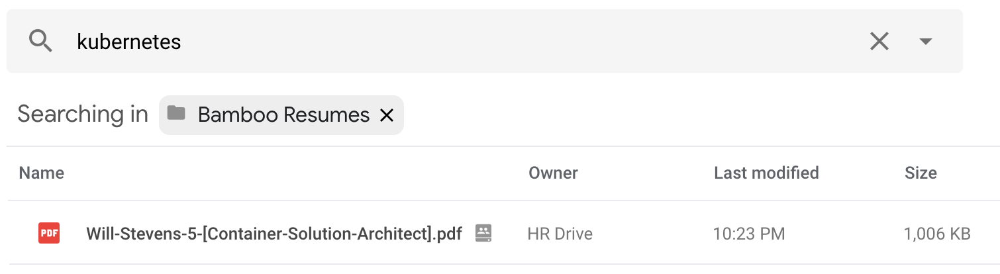

`bamboo`
========

A simple command line tool to download resumes from BambooHR in bulk.  

In our use of BambooHR, we found that we wanted to be able to search the contents of the uploaded resumes, but that feature is not available through the native BambooHR UI.  In order to achieve this, I am using [Google Drive File Stream](https://support.google.com/a/answer/7491144?utm_medium=et&utm_source=aboutdrive&utm_content=getstarted&utm_campaign=en_us) to automatically upload the resumes I download to our G Suite Drive (or Team Drive), allowing the resume files to be searched using Google Drive's search functionality.



Only resumes which have not already been downloaded (or a rating has changed on) are downloaded on each consecutive run.

Here is a sample run:
```
$ ./bamboo -u=example@email.com
Enter your password:
Starting downloads...
/Users/user/Google Drive File Stream/Team Drives/Bamboo Resumes/John-Smith-0-[Full-Stack-Developer].docx
/Users/user/Google Drive File Stream/Team Drives/Bamboo Resumes/Julie-Smith-4-[Cloud-Solutions-Architect].docx
/Users/user/Google Drive File Stream/Team Drives/Bamboo Resumes/Paul-Smith-0-[DevOps-Engineer].docx
/Users/user/Google Drive File Stream/Team Drives/Bamboo Resumes/Mary-Smith-0-[Intern].pdf
Downloaded 4 resumes
```

Here is the `help` output:
```
$ ./bamboo -h
Usage of ./bamboo:
  -dl string
    	Path to save the files to (validate) (default "/Users/user/Google Drive File Stream/Team Drives/Bamboo Resumes")
  -n string
    	Number of results to query (optional) (default "500")
  -p string
    	Password of the user (optional, will be prompted)
  -subdomain string
    	Subdomain in BambooHR [<subdomain>.bamboohr.com] (optional) (default "cloudops")
  -u string
    	Email Address of the user (required)
```

*Note: The '-subdomain' and '-dl' (download path) will likely need to be specified for your use...*